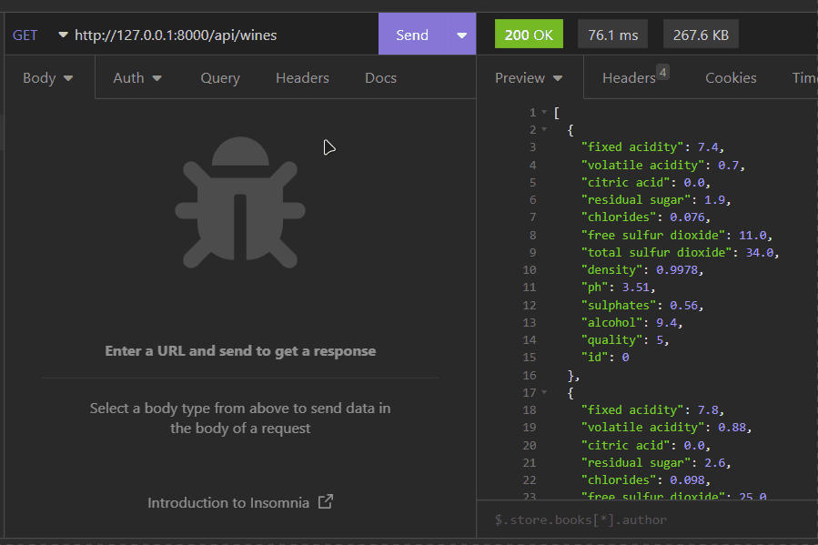

# Wine Quality Predictor App 🍷

Une application qui vous permet de prédire la qualité d'un vin à partir de ses
caractéristiques.

## Présentation

Notre application utilise des modèles de machine learning pré-entrainés pour prédire la qualité d'un vin sur une échelle
de 0 à 10. Vous pouvez choisir entre deux modèles différents: un modèle de régression linéaire simple et un modèle de
forêt aléatoire.

En plus de la prédiction de qualité, notre application vous permet également d'ajouter de nouvelles données au dataset
utilisé pour l'entrainement des modèles. Vous pouvez ainsi mettre à jour nos modèles pour améliorer leur performance.

Mais ce n'est pas tout! Si vous avez une bouteille de vin particulièrement exceptionnelle, vous pouvez l'ajouter à notre
dataset ; Cela permettra de retrainer nos modèles et de les rendre encore plus précis dans leur prédiction de qualité.




## How to run it locally

- Clone the repository
- Create a virtual environment with the following command:

```
virtualenv -p python3 venv
```

- Activate the virtual environment with the following command:

```
source venv/bin/activate
```

- Install the requirements with the following command:

```
pip install -r requirements.txt
```

- Go to the app folder with the following command:

```
cd app
```

- Run the app with the following command:

```
uvicorn main:app --reload
```

- The app default to the following url:

```
127.0.0.1:8000
```

- You can access the documentation of the API at the followings url:

```
127.0.0.1:800/docs
127.0.0.1:800/redoc
```

## Utilisation

Voici comment utiliser les différentes routes de l'API Wine Quality Predictor.

### Prédiction de la qualité d'un vin

Pour effectuer une prédiction de la qualité d'un vin en utilisant un modèle de machine learning spécifié.

*Exemple de requête :*

```http request
POST /api/predict
Content-Type: application/json

{
    "fixed_acidity": 7.4,
    "volatile_acidity": 0.7,
    "citric_acid": 0,
    "residual_sugar": 1.9,
    "chlorides": 0.076,
    "free_sulfur_dioxide": 11,
    "total_sulfur_dioxide": 34,
    "density": 0.9978,
    "pH": 3.51,
    "sulphates": 0.56,
    "alcohol": 9.4
}

```

*Exemple de réponse :*

```http request
HTTP/1.1 200 OK
Content-Type: application/json

{
    "model_name": "randomforest",
    "quality_predicted": 7,
    "wine": {
        "fixed_acidity": 7.4,
        "volatile_acidity": 0.7,
        "citric_acid": 0,
        "residual_sugar": 1.9,
        "chlorides": 0.076,
        "free_sulfur_dioxide": 11,
        "total_sulfur_dioxide": 34,
        "density": 0.9978,
        "pH": 3.51,
        "sulphates": 0.56,
        "alcohol": 9.4
    }
}
```

### Prédiction du vin parfait

Pour obtenir une combinaison de données permettant d'identifier le "vin parfait" (probablement inexistant mais
statistiquement possible), utilisez la route suivante :

```http request
GET /api/predict
```

### Recupération des modèles serialisés

Pour récupérer les modèles serialisés, utilisez la route suivante :

```http request
GET /api/model
```

avec le paramètre `model_name` qui peut prendre les valeurs suivantes :

- `linearregression`
- `randomforest`

### Description des modèles

Pour obtenir une description des modèles, utilisez la route suivante :

```http request
GET /api/model/description
```

avec le paramètre `model_name` qui peut prendre les valeurs suivantes :

- `linearregression`
- `randomforest`

### Enrichissement du dataset

Pour ajouter de nouvelles données au dataset, utilisez la route suivante :

```http request
PUT /api/model
Content-Type: application/json

{
    "fixed_acidity": 7.4,
    "volatile_acidity": 0.7,
    "citric_acid": 0,
    "residual_sugar": 1.9,
    "chlorides": 0.076,
    "free_sulfur_dioxide": 11,
    "total_sulfur_dioxide": 34,
    "density": 0.9978,
    "pH": 3.51,
    "sulphates": 0.56,
    "alcohol": 9.4
}
```

### Reentrainement du modèle

Pour retrain un modèle de machine learning, avec les nouvelles données ajoutées au dataset, utilisez la route suivante :

```http request
POST /api/model/retrain
```

avec le paramètre `model_name` qui peut prendre les valeurs suivantes :

- `linearregression`
- `randomforest`

## Endpoints list

### Wines Routes

> ```GET api/wines```
>> Get all the wines from the dataset

> ```GET api/wines/{wine_id}```
>> Get a specific wine from the dataset

> ```POST api/wines```
>> Add a new wine to the dataset

> ```PUT api/wines/{wine_id}```
>> Update a specific wine from the dataset

> ```DELETE api/wines/{wine_id}```
>> Delete a specific wine from the dataset

### Model Routes

> ```GET api/model```
>> Get the model used to predict the quality of the wine

> ```PUT api/model```
>> Update the model used to predict the quality of the wine by adding a new wine to the dataset

> ```GET api/model/description```
>> Get various information about the model used to predict the quality of the wine, like the metrics (see below) of the last training, the hyperparameters of the model, and informations related to the model object.

> ```POST api/model/retrain```
>> Retrain the model used to predict the quality of the wine, save the model and the metrics of the training

### Predictions

> ```GET api/predict```
>> Return the features of the best wine possible based on predefined criteria (see below)

> ```POST api/predict```
>> Predict the quality of a given wine using the model

## Dataset

📦 1153 samples wine with 12 features each.

The features are:

- fixed acidity
- volatile acidity
- citric acid
- residual sugar
- chlorides
- free sulfur dioxide
- total sulfur dioxide
- density
- pH
- sulphates
- alcohol
- **quality** (score between 0 and 10)

## Choices 

#todo

## Authors 👨🏾‍💻

- Mlamali SAID SALIMO ([LinkedIn](https://www.linkedin.com/in/mlamalisaidsalimo/), [GitHub](https://www.linkedin.com/in/mlamalisaidsalimo/))
- Benoit Gaillard

